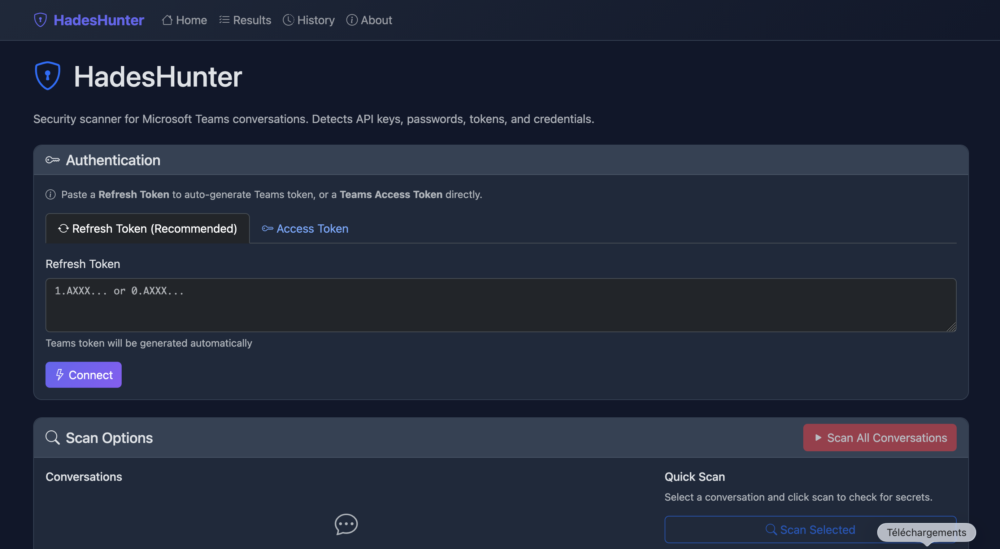
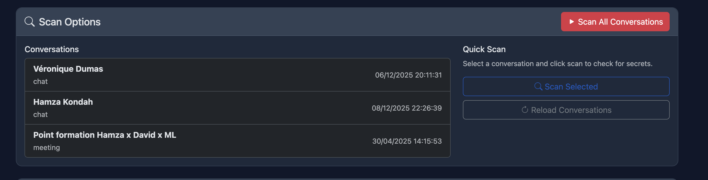
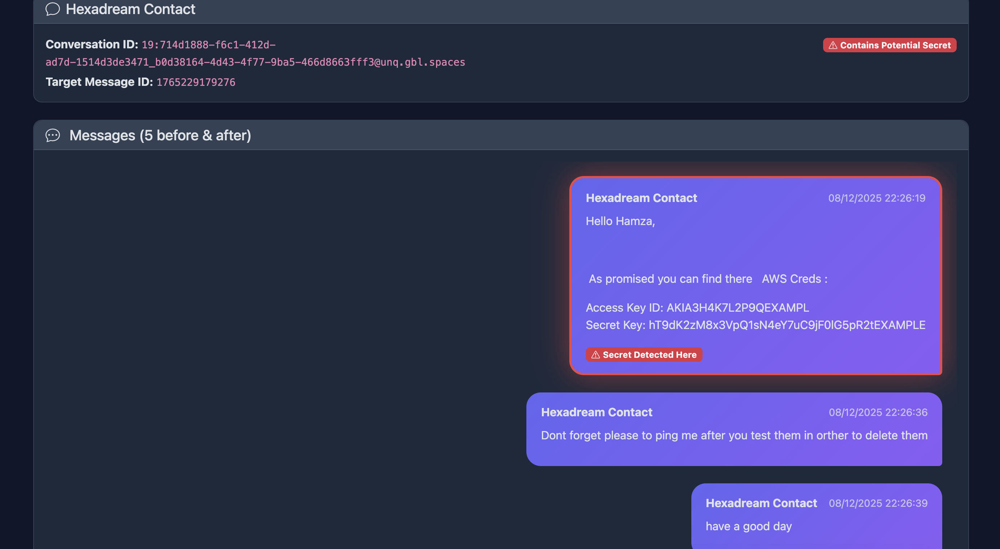
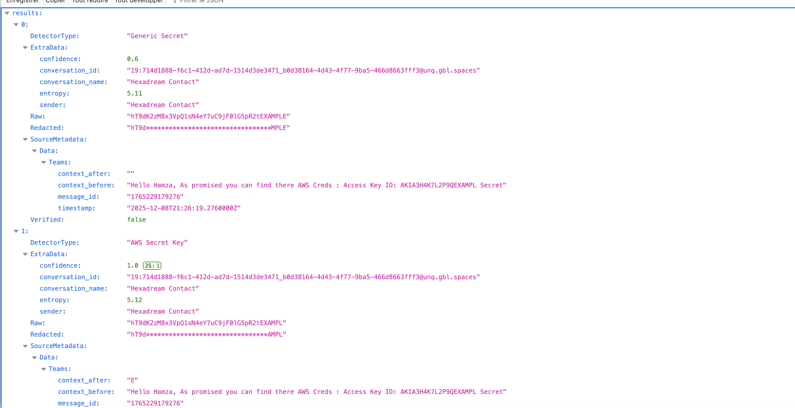

# HadesHunter
Secret scanner for Microsoft Teams conversations (and more is coming).
HadesHunter was created to address a common blind spot in corporate security: chat platforms. During penetration tests and red team engagements, I noticed that Microsoft Teams conversations often contain sensitive data that users share without thinking twice - passwords, API keys, connection strings, and more.
This tool automates the discovery of these secrets, helping security professionals demonstrate the real-world risk of credential sharing in chat applications.


## Why?

Corporate chat platforms like Microsoft Teams are often overlooked during security assessments. Users frequently share sensitive information in chat messages without realizing the risk:

- Passwords and credentials shared between colleagues
- API keys sent "just this once" for quick access
- Connection strings copy-pasted for convenience
- Private keys shared during troubleshooting
- Service account credentials exchanged during onboarding

This data persists in chat history and can be accessed by attackers who compromise a user account or obtain valid tokens. HadesHunter helps identify these exposures.


## Demo

https://github.com/user-attachments/assets/86c0d931-3acd-4807-9621-cbe191845145



## What it does

HadesHunter scans Teams conversations to detect leaked secrets:

- **Cloud credentials** - AWS keys, Azure secrets, GCP tokens
- **API keys** - GitHub, Slack, OpenAI, Stripe, SendGrid, Twilio, Discord
- **Authentication tokens** - JWT, Bearer, OAuth, Basic Auth
- **Infrastructure secrets** - Database URLs, connection strings, private keys
- **Shared passwords** - Credentials exchanged in natural language

Multilingual detection: English, French, German, Spanish, Portuguese, Italian, Dutch, Polish.

## Use cases

- **Penetration testing** - Identify credential leaks after obtaining Teams access
- **Red team operations** - Demonstrate risk of chat-based credential sharing
- **Security audits** - Check for policy violations in corporate communications
- **Incident response** - Assess exposure scope after account compromise

## Installation

```bash
git clone https://github.com/anak0ndah/HadesHunter
cd HadesHunter
python3 -m venv venv
source venv/bin/activate
pip install -r requirements.txt
```

## Usage

```bash
python app.py
```

Open http://127.0.0.1:5000

### Authentication

HadesHunter needs a valid Teams API token to access conversations. Two options:

**Option 1: Refresh Token (recommended)**

Paste a Microsoft refresh token obtained via phishing, token theft, or other means. HadesHunter will automatically exchange it for a Teams-specific access token by calling:

```
POST https://login.microsoftonline.com/{tenant}/oauth2/token
- resource: https://api.spaces.skype.com
- client_id: d3590ed6-52b3-4102-aeff-aad2292ab01c (Microsoft Office)
- grant_type: refresh_token
```

The tool tries multiple tenant endpoints (`organizations`, `common`) if the tenant ID is unknown.

**Option 2: Access Token**

If you already have a valid access token for the `api.spaces.skype.com` resource, paste it directly.

**Why this approach?**

Refresh tokens are long-lived and can be reused. Access tokens expire quickly (~1 hour). By using a refresh token, HadesHunter can generate fresh access tokens as needed without requiring re-authentication.

### Scanning

Once authenticated, conversations load automatically:



1. **Single scan** - Select a conversation and click "Scan Selected"
2. **Full scan** - Click "Scan All Conversations"

### Results

Detected secrets are displayed with confidence level and entropy score:


Click on a secret to view the message context (5 messages before/after):



Export results to JSON for reporting.



## Security

Secrets are stored in a local SQLite database (`teams_scanner.db`) to enable export functionality. A SHA-256 hash is used for deduplication. 

## Credits

This tool was built using concepts and code from:

- **[TruffleHog](https://github.com/trufflesecurity/trufflehog)** by Truffle Security - Secret detection patterns and entropy-based analysis algorithms were adapted from their approach
- **[GraphSpy](https://github.com/RedByte1337/GraphSpy)** by RedByte1337 - Teams API integration, token handling, and web interface structure were inspired by their implementation

## Disclaimer

**This tool is intended for authorized security testing only.**

- Only use on accounts and tenants you have explicit permission to test
- Ensure you have written authorization before scanning any environment
- Handle discovered secrets confidentially and report them appropriately
- The author is not responsible for any misuse or illegal activity


## Version

v1.0 - Initial release. More features coming soon.

## License

MIT

---

Made with ❤️ by [Kondah Hamza](https://www.linkedin.com/in/kondah/)
